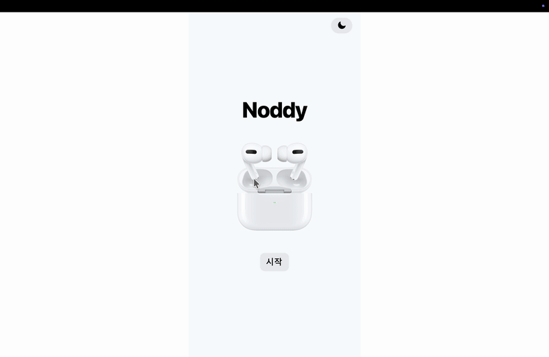
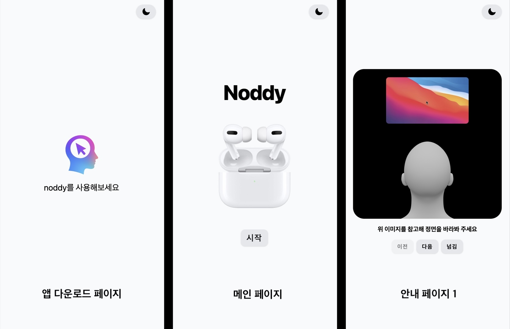
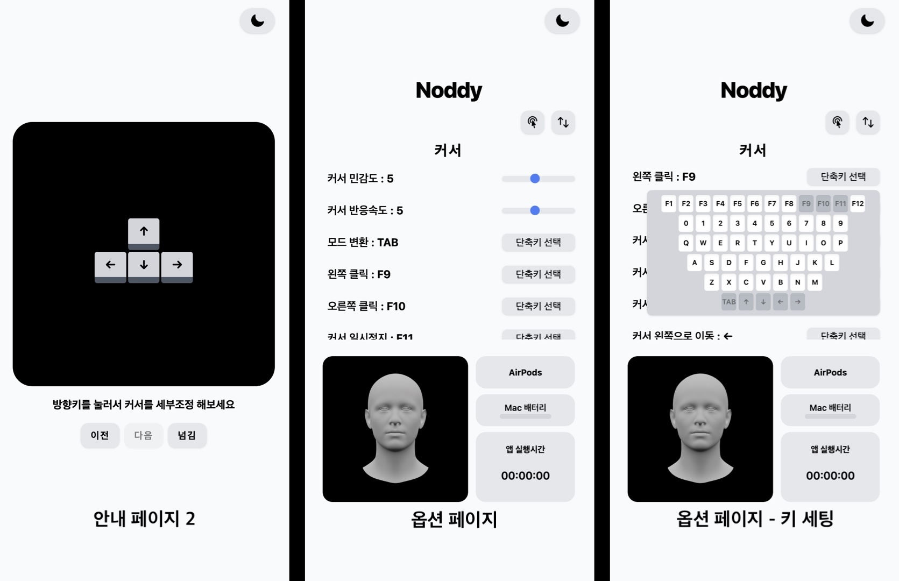
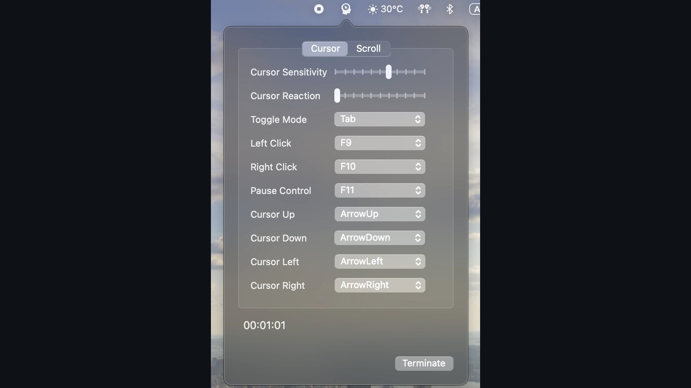
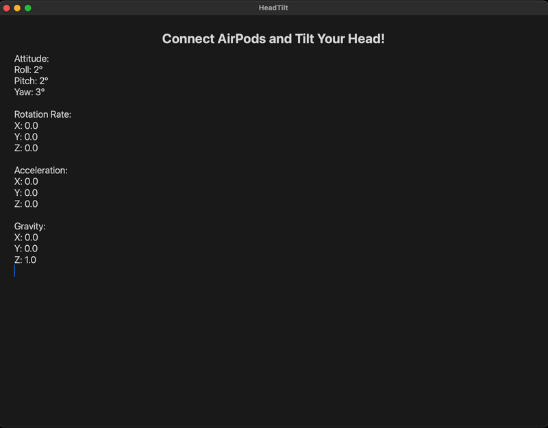
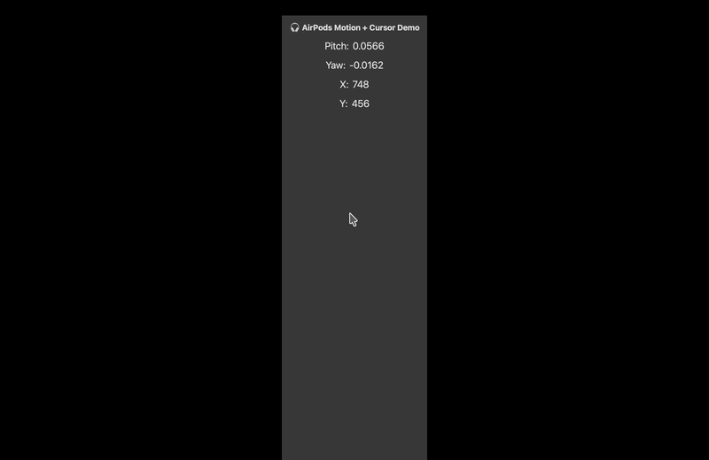

# Noddy


**Noddy**는 AirPods의 모션 센서를 활용해, 머리 움직임만으로도 Mac에서 마우스 커서를 자연스럽게 제어할 수 있도록 만든 앱입니다.
단축키로 클릭·드래그 같은 마우스 기능을 수행하고, 웹 대시보드에서 민감도·조작 모드 같은 설정을 실시간으로 변경할 수 있습니다.

# 목차

- [🔥 동기](#-동기)
- [📖 프리뷰](#-프리뷰)
- [💻 개발](#-개발)
- [🚀 최적화](#-최적화)
- [👌 사용자 경험](#-사용자-경험)
- [💥 트러블 슈팅](#-트러블-슈팅)
- [⚒️ 리팩토링](#️-리팩토링)
- [🎯 기능](#-기능)
- [📚 기술 스택](#-기술-스택)
- [🗓️ 기간](#-기간)

# 🔥 동기

해당 팀 프로젝트를 시작한 계기는 아주 단순하면서도 중요한 질문에서 출발했습니다.

**“컴퓨터를 조금 더 편리하게 조작할 수는 없을까?”**

현대인의 삶에서 컴퓨터는 필수적인 도구지만, 여전히 불편함이 남아있습니다.
마우스는 한 손으로 비교적 쉽게 움직일 수 있지만, 키보드를 다루려면 두 손을 모두 사용해야 합니다.
그러다 보니 사용자는 항상 한 손으로만 할 수 있는 조작과, 반드시 두 손이 필요한 조작 사이를 오가며 느끼게 되는 번거로움은 불가피하다고 생각했습니다. 특히 빠르게 무언가를 입력하면서 동시에 화면을 움직이거나 클릭해야 할 때 이 불편함은 더욱 크게 다가옵니다.

저희는 이 문제를 해결하기 위해 몇 가지 가설을 세웠습니다.

1. 두 손만으로 마우스와 키보드를 동시에 조작할 수 있을까?
2. 가능하다면, 둘 중 하나를 다른 것으로 대체할 수는 없을까?
3. 마우스와 키보드가 가진 장점을 유지하면서도, 더 자연스럽게 쓸 수 있는 방법은 없을까?
4. 컴퓨터를 조작하는 데 있어 ‘손’ 이외에 쓸 수 있는 신체 부위가 있을까?

이 질문들을 따라가며, 저희는 한 가지 흥미로운 가능성에 도달했습니다.

**“손이 아니라 머리로 컴퓨터를 조작할 수 있다면 어떨까?”**

머리야말로 사용자가 화면을 바라보는 동안 커서의 위치와 머리의 방향이 자연스럽게 동기화되어 움직이는 부위이며, 손과 달리 키보드나 다른 입력장치와 동시에 쓸 수 있다는 장점이 있다고 생각했습니다.
머리 움직임을 입력 장치로 활용하면, 손을 떼지 않고도 마우스를 대신할 수 있고, 키보드 작업과 병행할 수도 있겠다는 확신이 들었습니다.

그러던 중 저희는 **에어팟의 모션 센서를 활용할 수 있는 API**를 발견하게 되었고,
이를 통해 머리의 움직임 데이터를 실시간으로 받아올 수 있다는 가능성까지 확인했습니다.
이 기술을 접목한다면, 누구나 이미 가지고 있는 에어팟만으로도 머리 움직임을 감지해 마우스를 조작할 수 있겠다는 아이디어로 발전하게 되었습니다.

# 📖 프리뷰

### 🎥 에어팟과 머리의 움직임을 통한 커서 조작 영상



### 📸 웹페이지 스크린샷





### 📸 앱 툴바 스크린샷



# 💻 개발

## 1. 머리 움직임을 어떻게 컴퓨터 커서 움직임으로 바꿀까?

### 1.1 `CMHeadphoneMotionManager`를 활용한 자이로스코프 데이터 추출

`CMHeadphoneMotionManager`는 에어팟을 착용한 사용자의 머리 움직임을 측정할 수 있는 Swift 언어 내 Core Motion API로 에어팟에 내장된 자이로스코프와 가속도계 센서를 활용한 데이터를 제공합니다.

자이로스코프는 3축(x, y, z) 방향의 회전율(angular velocity) 을 측정할 수 있으며,
이를 통해 사용자가 고개를 어느 방향으로 얼마나 빠르게 움직이고 있는지를 실시간으로 파악할 수 있습니다.



해당 API가 제공하는 데이터 중 주요 데이터로는:

- `roll`: 좌우 기울기
- `pitch`: 상하 기울기
- `yaw`: 머리의 회전 상태를 표현(수평 회전)

위 데이터를 실시간으로 받아올 수 있었으며 저희 프로젝트에서는 머리의 방향에 따라 달라지는 값인 `attitude`의 `pitch`와 `yaw` 값을 중심으로, 사용자의 머리 움직임을 마우스 커서의 XY 좌표와 자연스럽게 매핑하는 로직을 구현하고자 했습니다.

- `pitch`: 머리(고개)를 위아래로 드는 움직임에 대한 데이터로 활용(모니터의 y축). 커서를 위로 올리고 싶다면 조금 더 고개를 드는 식으로 조작.
- `yaw`: 머리를 좌우로 돌리는 움직임을 나타냄(모니터의 x축). 왼쪽으로 커서를 움직이고 싶다면 고개를 왼쪽으로 돌리는 식으로 조작.

### 1.2 사용자의 머리 움직임을 화면 내 커서의 XY 좌표로 어떻게 자연스럽게 매핑할까?

사용자가 에어팟을 착용하고 위 API를 호출하고 움직이지 않고 정면을 바라볼 때 각도값은 0에 수렴합니다.
따라서, 반환되는 데이터 값도 0인 것을 활용하여 커서가 화면의 정중앙에 있을 떄 `pitch`와 `yaw` 값이 0이라고 설정했습니다. 하지만 받아온 `pitch`와 `yaw` 값은 센서 노이즈가 포함된 라디안 단위의 연속적인 실수값이고, 이로 인해 화면 커서 좌표에 매핑하면 민감하고 부자연스럽게 커서가 움직이는 문제점이 있었습니다.

```swift
attitude.pitch   // 0.123456789012345
attitude.yaw     // -1.5707963267948966
```

## 2. 커서의 노이즈 처리를 위한 필터링 작업

위와 같이 필터링되지 않은 `pitch`와 `yaw` 값은 사용자의 의도와 무관한 작은 떨림이나 움직임까지도 데이터로 수집하여 커서가 불안정하게 흔들리거나 튀는 현상을 발생시킵니다. 이는 사용자 입장에서 원하지 않는 상황에서도 커서가 계속해서 움직이고, 정확한 조작이 어렵기 만들기 때문에 서비스와 사용자 간의 인터랙션을 저하시킬 수 있는 요인이었습니다.

저희는 위 문제를 해결하기 위해, 다음과 같은 단계를 거쳐 머리 움직임을 부드럽고 자연스럽게 화면 좌표에 대응하도록 설계했습니다:

### 2.1 센서 값 필터링

```swift
filteredPitch = filteredPitch + filterAlpha * (pitch - filteredPitch)
filteredYaw = filteredYaw + filterAlpha * (yaw - filteredYaw)
```

- 실시간으로 들어오는 `pitch`와 `yaw` 값에 **Low-pass filter**를 적용해,
  갑작스러운 움직임이나 노이즈 완화
- `filterAlpha` 값으로 필터의 민감도를 조절

### 2.2 움직임 임계값(데드존) 설정

```swift
let movementThreshold = 0.0088
let finalPitch = abs(filteredPitch) < movementThreshold ? 0 : filteredPitch
let finalYaw = abs(filteredYaw) < movementThreshold ? 0 : filteredYaw
```

- 작은 움직임을 무시해 커서가 사소하게 흔들리지 않도록 함
- 사용자가 실제로 "머리를 움직였다" 싶은 수준 이상에서만 커서가 움직이도록 설정(QA 테스트를 진행하여 임의의 값 설정)

### 2.3 좌표계 정규화

```swift
let normalizePi: Double = .pi / cursorSensitivity
let normalizedPitch = ((finalPitch) + normalizePi / 2) / normalizePi + pitchOffset
let normalizedYaw = ((finalYaw) + normalizePi) / (2 * normalizePi) + yawOffset
```

- 라디안 범위를 (0,1) 근처의 값으로 변환
- `cursorSensitivity` 값으로 민감도를 조절
- 초기 기준값 보정을 위해 `pitchOffset`, `yawOffset`을 더함
- (사용자가 화면 정중앙을 바라볼 때 커서가 화면 중앙 (0,0)에 위치)

### 2.4 화면 해상도에 맞춰 매핑

```swift
let mappedX = screenWidth * CGFloat(normalizedYaw)
let mappedY = screenHeight * (1 - CGFloat(normalizedPitch))
```

- 정규화된 값을 실제 화면 픽셀 좌표로 변환
- `pitch`는 화면의 Y축, `yaw`는 X축에 대응
- 화면 해상도(`screenWidth`, `screenHeight`)에 따라 자동으로 맞춰짐

### 2.5 결과



위 과정을 통해 다음과 같은 성능 및 사용자 경험 최적화를 이루었습니다:

- 사용자가 화면의 정중앙을 바라볼 때 커서가 화면 중앙에 위치
- 머리를 좌우로 돌리면 `yaw`가 변해 커서가 X축으로 이동
- 머리를 위아래로 움직이면 `pitch`가 변해 커서가 Y축으로 이동
- **Low-pass filter** 적용으로 커서가 노이즈에 흔들리거나 튀는 현상을 최소화
- **데드존** 설정으로 사용자가 의도하지 않은 작은 움직임을 무시 → 커서의 안정성 확보
- 필요한 값만 실시간 계산하고, 불필요한 연산을 제거 → CPU 사용량과 지연(latency) 감소
- 너무 작은 움직임은 무시, 빠른 움직임은 부드럽게 처리

결과적으로, 머리 움직임만으로도 자연스럽고 직관적으로 커서를 조작할 수 있게 되었습니다.

## 3. 커서 데이터 조작을 위한 웹 대시보드 개발

AirPods의 모션 데이터를 활용해 커서를 조작하는 시스템은 각 사용자마다 고유한 움직임 습관(고개 각도, 반응 속도 등)을 반영할 수 있어야 한다고 판단하였습니다.
기본 설정만으로는 사용자마다 커서가 너무 빠르거나, 느리거나, 혹은 데드존 영역이 적절하지 않다고 느낄 수 있었고, 이러한 문제는 정적인 설정값만으로 해결하기 어렵다는 한계가 있었습니다.
따라서 사용자가 직접 민감도와 데드존, 기준 각도 등을 실시간으로 조정하고 결과를 즉시 확인할 수 있는 대시보드의 필요성을 느꼈으며 이를 위해 웹 기반 대시보드를 도입하게 되었습니다.

### 3.1 왜 웹 대시보드였나

- 즉시 접근성
  사용자는 별도의 앱 설치 과정 없이, 웹 브라우저를 통해 즉시 대시보드에 접근할 수 있습니다.
  Swift 앱은 백그라운드에서 실행된 상태로 유지되며, 사용자는 브라우저를 통해 민감도, 데드존, 기준 각도 등의 설정을 실시간으로 조정할 수 있습니다.
  이러한 구조는 복잡한 설정 변경 과정 없이 직관적이고 유연한 사용자 경험을 제공하며, 전체 서비스와 접근성과 활용도를 향상시키기 위함입니다.

### 3.2 Swift에서 수집한 Motion 데이터를 웹에서 조작하기

브라우저에서 즉시 Motion 데이터(pitch, yaw)를 조작하기 위해서는, Swift 앱에서 수집한 모션 데이터 값을 실시간으로 수정하거나 제어할 수 있어야 합니다.
이를 위해 WebSocket 기반의 양방향 통신 구조를 도입하여, Swift 앱에서 수집한 모션 데이터를 웹 대시보드로 실시간 전송하고, 반대로 대시보드에서 조작한 설정값은 다시 Swift 앱에 즉시 반영되도록 구현하였습니다.

각 플랫폼 혹은 서버의 역할은 아래와 같습니다.

<Swift 앱>

- CMHeadphoneMotionManager를 통해 AirPods의 pitch, yaw 데이터를 실시간 수집
- WebSocket 통신은 Swift의 WebSocket 클라이언트 API인 URLSessionWebSocketTask 기반으로 구현
- 수집된 데이터를 JSON 포맷으로 가공하여 WebSocket 클라이언트를 통해 서버로 전송
- 웹으로 부터 수신된 명령(예: 커서 감도 변경, 모드 전환 등)은 macOS에서 로컬 커서 이동, 스크롤 등으로 즉시 반영

<WebSocket Server(AWS EC2)>

- AWS EC2 인스턴스에 WebSocket 서버(Node.js 기반) 별도 구축
- 클라이언트(Swift 또는 React) 연결을 관리하며, 수신 메시지를 구분/브로드캐스트
- Swift에서 수신한 모션 데이터를 React 대시보드로 전파
- React에서 설정값 변경 시, 이를 Swift 앱으로 전송하여 동작 제어

<웹 대시보드>

- useSocket 커스텀 훅을 통해 WebSocket 서버에 연결
- Swift 앱에서 전송된 모션 데이터를 수신하여 실시간으로 커서 조작에 반영
- 사용자가 대시보드에서 설정값(커서 민감도, 스크롤 모드 변환 등)을 조정하면 WebSocket을 통해 서버로 전송 → 서버에서 Swift 앱으로 전달되어 즉시 반영됨

# 👌 사용자 경험

## 1. 키보드 단축키를 활용한 마우스 기능 제공

머리의 움직임으로 커서의 위치를 조작하지만 그 외 마우스가 제공하는 기능들을 수행하지 못하면 앞선 것들이 무의미해지게 됩니다. 이를 보완하기 위해 **키보드 단축키**들을 이용하여 다음과 같은 기능들을 제공합니다.

|      기능       | 동작 방식                          | 구현 방식                                                                    |
| :-------------: | :--------------------------------- | :--------------------------------------------------------------------------- |
|   **좌클릭**    | 단축키 한 번 클릭                  | 현재 커서 위치에서 `.leftMouseDown` → `.leftMouseUp` 이벤트 발생             |
|  **더블클릭**   | 빠르게 두 번 클릭                  | `NSEvent.doubleClickInterval` 기준으로 `clickCount` 를 2로 설정              |
|   **우클릭**    | 단축키 한 번 클릭                  | `.rightMouseDown` → `.rightMouseUp` 이벤트 발생                              |
|   **드래그**    | 단축키를 누른 상태로 머리를 움직임 | `simulateDragWhileMouseDown()` 로 주기적으로 `.leftMouseDragged` 이벤트 발생 |
| **커서 초기화** | 단축키 한 번 클릭                  | 화면 중앙으로 커서 위치 이동                                                 |
|  **감도 조절**  | 단축키 한 번 클릭                  | `cursorSensitivity` 값을 조절                                                |

---

### 1.1 구현 방식

- Quartz API의 `CGEvent` 로 마우스 클릭/드래그 이벤트 생성
- `clickCount` 와 `NSEvent.doubleClickInterval` 로 더블클릭 감지
- 드래그는 `leftMouseDown` 이후 일정 간격으로 `leftMouseDragged` 이벤트 발생
- Space, Shift, Esc, +, - 등의 전역 단축키로 기능 제어

### 1.2 코드

```swift
static func leftMouseDownAtCursor() {
    let currentTime = CFAbsoluteTimeGetCurrent()
    let timeSinceLastClick = currentTime - lastClickTime
    if timeSinceLastClick < NSEvent.doubleClickInterval {
        clickCount = min(clickCount + 1, 2)
    } else {
        clickCount = 1
    }
    lastClickTime = currentTime
    click(mouseType: .leftMouseDown, button: .left, clickCount: clickCount)
    simulateDragWhileMouseDown()
}

static func simulateDragWhileMouseDown(duration: TimeInterval = 1.0, interval: TimeInterval = 0.01) {
    let endTime = Date().addingTimeInterval(duration)
    var lastPos = currentCursorPos
    DispatchQueue.global(qos: .userInteractive).async {
        while Date() < endTime {
            let currentPos = currentCursorPos
            if currentPos != lastPos {
                leftMouseDragAtCursor(to: currentPos)
                lastPos = currentPos
            }
            usleep(useconds_t(interval * 1_000_000))
        }
    }
}
```

## 2. three.js를 활용한 3D 모델 가이드 제공

머리 움직임 기반 커서 조작을 처음 접하는 사용자들이 더 빠르고 직관적으로 이해할 수 있도록,
**three.js 기반의 3D 가이드 모델**을 제공합니다.

### 2.1 구현 개요

| 파일명                        | 역할                                                    |
| :---------------------------- | :------------------------------------------------------ |
| **ThreeDimensionalImage.jsx** | - 화면에 3D 모델 가이드를 렌더링하는 메인 컴포넌트      |
| **Model3D.jsx**               | - 실제 3D 객체 로드 및 애니메이션 / 뷰포트 설정 등 처리 |

- `@react-three/fiber`, `@react-three/drei` 등 three.js 생태계 라이브러리 사용
- React 컴포넌트 구조로 손쉽게 상태 관리 및 UI와 연동

### 2.2 사용자 경험 측면의 기능

- 사용자가 머리를 어느 방향으로 움직이면 커서가 어떻게 이동하는지
  → 실시간으로 3D 가이드 모델을 통해 시각화
- 초기 설정 시 “머리를 이렇게 움직이면 이렇게 반응한다” 튜토리얼 제공
- 민감도 설정 변경 시 3D 가이드 모델도 즉시 반응 → 사용자가 체감 가능
- 가이드 모델을 회전/확대·축소할 수 있어, 다양한 각도에서 확인 가능

### 2.3 사용자 입장에서의 장점

- 머리 움직임과 화면 커서 사이의 매핑을 쉽게 이해
- 민감도·조작 모드를 바꿔가며 즉시 체감 가능
- 초보자도 빠르게 적응 가능, 진입장벽 감소

### 2.4 추가 구현 디테일

- GLTF / GLB 형식의 경량 3D 모델 로드
- React 상태 관리 라이브러리와 연동 → 민감도, 모드 변경 시 실시간 렌더
- 다크 모드·라이트 모드 테마와도 연동

### 2.5 코드

```jsx
// ThreeDimensionalImage.jsx
import React from "react";
import { Canvas } from "@react-three/fiber";
import Model3D from "./Model3D";

export default function ThreeDimensionalImage() {
  return (
    <Canvas camera={{ position: [0, 0, 3] }}>
      <ambientLight intensity={0.5} />
      <directionalLight position={[0, 0, 5]} />
      <Model3D />
    </Canvas>
  );
}

// Model3D.jsx
import React from "react";
import { useGLTF } from "@react-three/drei";
import { useMotionStore } from "@/stores/useMotionStore"; // pitch, yaw 상태 관리

export default function Model3D() {
  const { scene } = useGLTF("/models/headGuide.glb");
  const pitch = useMotionStore(state => state.pitch);
  const yaw = useMotionStore(state => state.yaw);

  return (
    <primitive
      object={scene}
      scale={1.2}
      rotation={[pitch, yaw, 0]} // 머리 움직임을 모델 회전에 반영
    />
  );
}
```

- 머리 움직임에서 얻은 `pitch`, `yaw` 값을 전역 상태(`useMotionStore`)에 저장
- 3D 모델의 `rotation` props에 적용 → 실시간으로 가이드 모델이 사용자 머리 움직임과 동기화

## 3. 스크롤 모드 구현

### 3.1 문제점: 문서 탐색의 불편함

에어팟 기반의 커서 제어 시스템을 구현하는 과정에서, 단순한 커서 이동 만으로 웹 페이지나 긴 문서를 편리하게 탐색하기 어렵다는 문제를 발견했습니다.

특히 손을 전혀 사용하지 않고 머리 움직임만으로 화면을 제어해야 하는 상황에서는, 웹 페이지를 아래로 스크롤하기 위해 커서를 화면의 우축 스크롤바로 정확히 이동시킨 다음, 단축키로 클릭하고 끌어내리는 과정을 반복해야 했습니다.

이 과정은 머리 움직임만으로 정밀하게 커서를 조작해야 하기 때문에 시간이 오래 걸리고, 원하는 위치에 커서를 정확히 위치시키기 어려우며,
한 번의 스크롤로 충분하지 않을 경우 여러 번 고개를 움직여야 하는 불편함이 따릅니다.

### 3.2 해결 방법: 고개 각도 기반 속도 조절 + 스크롤 모드 분리

<스크롤 전용 모드 분리>

앞서 언급한 문제점을 해결하기 위해 커서 이동과 스크롤 기능을 명확하게 분리하는 구조로 시스템을 재설계하였습니다.
사용자가 서비스를 이용하는 중 특정 단축키를 누르면 "스크롤 모드"로 진입하며, 이 모드에 들어가면 커서를 더 이상 직접 이동하지 않고, 고개 움직임만으로 화면을 위 아래로 스크롤할 수 있게 됩니다.

예를 들어, 사용자가 고개를 아래로 숙이면 페이지가 아래로, 고개를 위로 들면 페이지가 위로 스크롤됩니다.
이로써 사용자는 손을 전혀 쓰지 않고도 웹 페이지를 훨씬 더 자연스럽게 탐색할 수 있게 되었습니다.

<고개 각도에 따른 스크롤 속도 조절>

또한, 스크롤 모드 내에서도 단순히 방향만 조절하는 것이 아니라, 사용자의 고개 각도(pitch)에 따라 스크롤 속도도 자동으로 조절되도록 구현하였습니다.

```swift
    private func checkDistanceFromCenter() {
        guard !isCursorMode else { return }
        guard isScrolling else { return }

        let deltaY = pitchForScroll - centerPoint.y
        let absoluteDeltaY = abs(deltaY)

        let deadZone: CGFloat = 90 // 데드존 설정
        guard absoluteDeltaY > deadZone else { return } // 커서의 y축과 중앙의 차이가 데드존을 초과하지 않으면 함수 종료

        let maxSpeed: CGFloat = 30
        let dynamicSpeed = min(maxSpeed, ((absoluteDeltaY - deadZone) / scrollSensitivity) * maxSpeed)
        // 사용자의 고개 각도에 따른 스크롤 속도 조절

        let direction: CGFloat = deltaY < 0 ? 1 : -1
        postScrollWheelEvent(deltaY: Int32(dynamicSpeed * direction))
    }
```

- 고개를 조금 숙이면 -> 페이지가 천천히 스크롤되고
- 고개를 크게 숙이면 -> 페이지가 빠르게 스크롤되는 구조입니다.

### 3.3 결과

위 방식은 사용자가 페이지를 빠르게 훓어보고 싶을 때와, 내용을 천천히 읽고 싶을 때를 구분해 정확하게 사용자의 의도를 반영할 수 있도록 도와줍니다.
또한, 속도가 정해진 것이 아니라 실시간으로 사용자 움직임에 반응하므로, 더욱 직관적이고 몰입감 있는 스크롤 경험을 제공할 수 있게 되었습니다.

## 4. 다국어 지원

### 4.1 문제점: 제한적인 언어 지원

모든 UI 텍스트가 고정된 한국어로 작성되어 있어, 비한국어권 사용자들이 서비스를 사용하는 데 어려움이 있었습니다. 특히 브라우저 언어 설정이 영어인 사용자들이 처음 페이지를 접했을 때, 자연스럽게 이해하기 어려운 불편함이 있었습니다.

### 4.2 해결 방법: 브라우저 사용자 언어 설정 인식

이 문제를 해결하기 위해 브라우저의 navigator.language 객체를 활용하여 사용자의 현재 브라우저 언어를 기준으로 서비스를 제공할 수 있도록 다국어 지원 기능을 도입했습니다.

```jsx
import i18n from "i18next";
import { initReactI18next } from "react-i18next";
import LanguageDetector from "i18next-browser-languagedetector";

const resources = {
  en: { translation: { ... } },  // 영어 번역 리소스
  ko: { translation: { ... } },  // 한국어 번역 리소스
};

i18n
  .use(LanguageDetector)         // 브라우저 언어 감지
  .use(initReactI18next)         // React와 연결
  .init({
    resources,
    fallbackLng: "ko",           // 감지 실패 시 한국어로 기본 설정
    detection: {
      order: ["navigator"],      // navigator.language만 사용하여 감지
      caches: [],                // 언어 설정을 브라우저에 캐시하지 않음
    },
    interpolation: {
      escapeValue: false,        // HTML 이스케이프 방지
    },
  });

export default i18n;
```

그러나, 단순히 navigator.language만 사용하는 경우, 언어 감지는 가능하지만 매끄러운 언어 리소스 관리나 번역 적용 등이 어려웠습니다.
감지된 언어에 따라 UI 텍스트를 바꾸려면, 각 컴포넌트마다 조건문(if, switch)을 직접 써야 했고 사용자의 언어가 바뀌어도 컴포넌트가 자동으로 UI를 갱신해주지 않기 때문에 직접 리렌더링을 트리거하여야 했습니다. 따라서, `i18next,` `react-i18next`, `i18next-browser-languagedetector` 등의 라이브러리를 함께 사용하였으며 다음과 같은 이점을 얻을 수 있었습니다.

- 언어 리소스를 모듈화하여 관리할 수 있어 유지보수가 쉬워졌고,
- React 컴포넌트 내부에서 손쉽게 번역 문자열을 불러오고 적용할 수 있으며,
- 추후 다국어 확장이나 언어 전환 기능 구현 시 일관된 방식으로 손쉽게 확장할 수 있는 기반이 마련되었습니다.

# 💥 트러블 슈팅

## 1. 드래그가 되지 않는다.

### 1.1 배경

키보드 입력으로 마우스 동작을 흉내낼 때는 생각대로 단순하게 키 **_“클릭”_** 한 번으로 끝나지 않았습니다.<br>
좌클릭을 예로 들면 실제 마우스를 사용할 때처럼,

- 마우스 왼쪽 버튼을 누름 (`leftMouseDown`)
- 마우스 왼쪽 버튼을 뗌 (`leftMouseUp`)

혹은 드래그의 경우,

- 마우스 왼쪽 버튼을 누름 (`leftMouseDown`)
- 버튼을 누른 채로 마우스 이동 (`drag`)
- 마우스 왼쪽 버튼을 뗌 (`leftMouseUp`)

처럼 **_“누르고 → 움직이고 → 떼는”_** 흐름을 정확히 구현해줘야 했습니다.

### 1.2 문제

처음 구현에서는 단순히 아래 기존 좌클릭 로직만 구현하여

- 마우스 버튼 누르기 (`leftMouseDown`)
- 마우스 버튼 떼기 (`leftMouseUp`)

마우스 왼쪽 버튼이 눌렸다고 인식하게 한 뒤 마우스를 움직이면 자연스럽게 드래그가 될거라고 생각했습니다.<br>
하지만, 예상과 달리 드래그가 끊기거나 아예 인식되지 않는 문제가 발생했습니다.

### 1.3 해결 방법

문제를 분석해 보니, 시스템에서 드래그 상태로 인식하려면 버튼이 눌린 동안
마우스가 움직일 때마다 독립적으로 `leftMouseDragged` 이벤트를 계속 보내야 한다는 점을 간과했던 것이 원인이었습니다.

이 부분을 해결하기 위해 `leftMouseDown`(마우스 버튼 누르기) 직후에<br>
아래 `simulateDragWhileMouseDown()` 함수를 비동기로 실행해서,<br>
마우스가 움직이는 동안 주기적으로 `leftMouseDragged`(드래그) 이벤트를 계속 보내주도록 했습니다.

특히 정해진 시간 주기로 커서가 실제로 움직였는지 비교(`currentCursorPos != lastPos`)해서,<br>
움직였을 때만 이벤트를 보내 불필요한 이벤트는 줄이고, 필요한 드래그 이벤트는 안정적으로 전달되도록 만들었습니다.

```swift
/// 마우스 버튼을 누른 상태에서 일정 시간 동안 커서를 추적하며,
/// 커서가 실제로 움직일 때만 leftMouseDragged 이벤트를 보내는 함수
static func simulateDragWhileMouseDown(
    duration: TimeInterval = 1.0,     // 드래그를 시뮬레이션할 총 지속 시간 (초)
    interval: TimeInterval = 0.01     // 커서 위치를 체크하고 이벤트를 보낼 주기 (초)
) {
    let endTime = Date().addingTimeInterval(duration)
    var lastPos = currentCursorPos    // 마지막으로 드래그 이벤트를 보낸 커서 위치

    // 메인 스레드를 막지 않기 위해 비동기 글로벌 큐에서 실행
    DispatchQueue.global(qos: .userInteractive).async {
        while Date() < endTime {
            let currentPos = currentCursorPos
            // 커서가 실제로 움직였을 때만 drag 이벤트 전송
            if currentPos != lastPos {
                leftMouseDragAtCursor(to: currentPos)
                lastPos = currentPos
            }
            // interval(초)을 마이크로초 단위로 변환하여 잠시 대기
            // interval=0.01이며 10_000마이크로초 = 0.01초 대기
            usleep(useconds_t(interval * 1_000_000))
        }
    }
}
```

- 백그라운드(비동기) 작업을 처리하는 전역 큐인 `DispatchQueue.global`을 사용해서 메인 스레드를 막지 <br>않고 드래그 동안 UI나 다른 작업이 멈추지 않도록 처리
- `interval`은 초 단위지만, `usleep`은 마이크로초 단위만을 인식하기 때문에<br>`interval * 1_000_000`로 계산하여 마이크로초 단위로 변환
- 이렇게 과도한 CPU 사용을 막고, 드래그 이벤트를 약 0.01초 간격(약 100Hz)으로 보내 부드러운 드래그 구현
- `duration`은 드래그 상태를 몇 초간 유지할지 결정하며 기본값은 1초로, 필요시 조절

### 1.4 결과

이 개선을 통해 마우스 버튼을 누르고 커서를 움직이면, 실제 물리적인 마우스를 드래그하는 것처럼 자연스럽고 연속적인 드래그가 가능해졌습니다.
특히 빠르게 마우스를 움직일 때도 드래그 이벤트가 끊기지 않고 안정적으로 이어지며,
<br>시스템과 다른 앱에서도 올바른 드래그 상태로 인식되어 예전처럼 끊기거나 인식이 안 되는 문제가 사라졌습니다.

# ⚒️ 리팩토링

## 1. TypeScript 적용

현재 프로젝트는 JavaScript 기반으로 작성되어 있어 빠르게 기능을 개발하고 시연하기에는 유리했으나, 점점 코드가 커지고 컴포넌트 간 의존성이 복잡해지면서 추후 런타임 오류를 미리 발견하기 어려울 것이라고 생각했습니다.

이런 문제를 해결하고 코드의 안정성과 유지보수성을 높이기 위해,
앞으로 프로젝트를 TypeScript로<br>점진적으로 전환할 계획입니다.

### 1.1 전환 계획

- .jsx → .tsx 로 파일 확장자 변경
- props, state, API 응답 데이터 등에 대해 타입 정의 추가
- 기존 JavaScript 코드의 동작을 유지하면서 점진적으로 타입을 적용
- 먼저 핵심 컴포넌트와 상태 관리(store)부터 타입 적용 시작
- 이후 유틸 함수, 훅, 전역 설정 등으로 점차 확대

## 2. 전역 상태 관리

프로젝트 초기에는 각 컴포넌트 내부에서 `useState`를 사용해 상태를 관리했습니다.
하지만 개발이 진행되면서 여러 컴포넌트 간에 같은 데이터를 공유해야 하고, 구조가 복잡해지면서
props drilling, 불필요한 리렌더링, 예기치 못한 버그 등이 발생했습니다.

### 2.1 전역 상태와 지역 상태 분리

이 문제를 해결하기 위해 전역적으로 필요한 상태와, 컴포넌트 내부에서만 필요한 지역 상태를 분리했습니다.
모든 상태를 전역으로 관리하면 유지보수성이 떨어질 수 있으므로, **기능별로 별도의 store 파일**을 만들어 관리했습니다.

### 2.2 어떤 데이터를 전역 상태로 관리했는가?

- 여러 컴포넌트에서 동시에 구독·사용해야 하는 상태 (예: pitch, yaw 같은 센서 데이터)
- props drilling이 발생했던 설정 값들 (민감도, 모드 등)

### 2.3 구조화 과정

- 기능별로 store 파일을 분리 (`useMotionStore`, `useSettingsStore` 등)
- 컴포넌트에서 직접 필요한 전역 상태만 구독 → 불필요한 리렌더링 방지
- 전역 상태 변경 시, 웹 대시보드나 3D 가이드 모델 등에서도 즉시 반영되도록 설계

### 2.4 결과

- 코드 가독성과 유지보수성 향상
- props drilling 제거
- 상태 변경이 실시간으로 UI에 반영 → 사용자 경험 개선

# 🎯 기능

### 📱 앱

- 커서 조작
  - 에어팟 모션 센서 API의 데이터를 활용한 커서 위치 매핑 및 조작
  - 사용자가 보는 방향대로 마우스 커서 이동
- 도구 막대
  - 앱 실행시 별도의 **창 UI**를 제공하지 않는 헤드리스 앱
  - 그로 인한 맥북 화면 상단의 도구 막대에 추가할 수 있는 위젯 기능
  - 마우스 커서 민감도, 반응속도 및 각종 마우스 기능 단축키를 설정 기능

### 🌐 웹

- 테마 토글 버튼
- 브라우저에 설정된 사용자 언어를 인식해 해당 언어에 맞는 텍스트 제공
- 로그인 페이지
  - 구글 OAuth를 활용한 로그인 기능
  - 해당 유저 정보에 저장된 데이터 불러오기 및 저장
- 메인 페이지
  - 웹을 시작할 수 있는 시작버튼
- 안내 페이지
  - 커서 조작에 대한 간단한 사용방법 제공
- 옵션 페이지

  - 앱 도구막대에서 제공하던 동일한 커서 옵션 설정 기능 제공
  - three.js를 활용한 사용자의 머리 방향과 실시간 동기화되는 가상 헤드 이미지 제공

# 📚 기술 스택

### macOS


### Client


### Server


### Deployment


# 🗓️ 기간

- 프로젝트 기간: 2025년 5월 19일 ~ 6월 19일
- 1주차
  - 팀 협업 규칙 정립
  - 아이디어 수집 및 선정
  - 아이디어 POC
  - 기술 스택 선정
- 2주차
  - 칸반 작성
  - 프로젝트 (앱, 웹) 환경 설정
  - Swift 학습
  - API를 활용한 핵심 데이터 수집 및 정제
  - 전환 가능한 각 커서 및 스크롤 모드 구현
  - 마우스 기능을 실행하는 단축키 구현
- 3주차
  - 대시보드 웹 구현
  - 소켓 커스텀 훅 구현
  - CI/CD 파이프라인 구축
  - 웹-앱간 소켓 연결
  - 다크 모드 구현
  - 웹 배포
- 4주차
  - 로그인 기능 구현
  - 앱 도구막대 구현
  - 사용자 언어 감지 및 언어에 맞는 텍스트 제공 기능 구현 (한국어, 영어)
  - 종합 테스트
- 5주차
  - 앱 배포
  - README.md 작성
